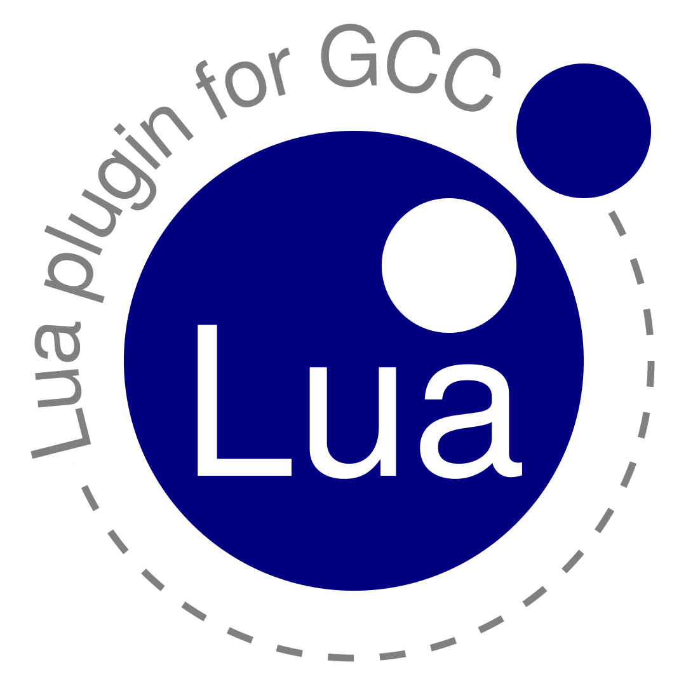

{.right width=128 height=128}
The [Lua plugin for GCC] extends the [GNU Compiler Collection] with the ability
to run Lua scripts. The plugin provides an interface to register callback
functions for plugin events, and inspect the abstract syntax tree of a
translation unit. The plugin is useful for static C code analysis. The Lua
plugin for GCC supports GCC 4.5 to 8 and [Lua] 5.1 or 5.2 or 5.3 or [LuaJIT].

# Acknowledgements

I would like to thank David Malcolm, author of the [GCC Python plugin], whose
code and documentation was of invaluable aid in comprehending the GCC internal
API.

[GCC Python plugin]: https://gcc-python-plugin.readthedocs.io/
[GNU Compiler Collection]: https://gcc.gnu.org/
[Lua]: https://www.lua.org/
[LuaJIT]: https://luajit.org/
[Lua plugin for GCC]: https://peter.colberg.org/gcc-lua
